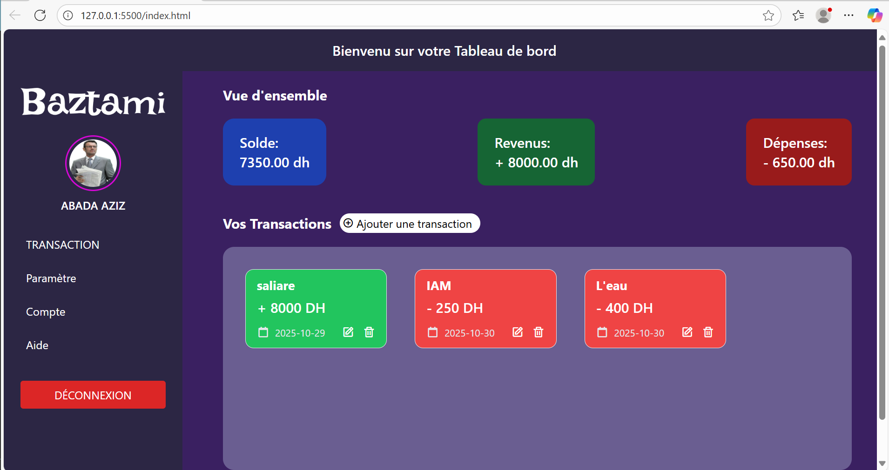

```markdown
#  Beztami - Tableau de bord des transactions

Beztami est une application web simple et intuitive permettant de **gérer vos revenus, vos dépenses et votre solde en temps réel**.  
Elle offre une interface moderne construite avec **Tailwind CSS** et **JavaScript**, tout en assurant l’accessibilité et la compatibilité sur tous les appareils.

---

##  Fonctionnalités principales

-  **Calcul automatique du solde** : revenus - dépenses, affiché en temps réel.  
-  **Ajout, modification et suppression de transactions**.  
-  **Sauvegarde locale via LocalStorage** — vos données persistent même après rechargement.  
-  **Interface responsive** (mobile, desktop).  

---

## Technologies utilisées

| Technologie | Utilisation |
|-------------|--------------|
| **HTML5** | Structure sémantique du tableau de bord |
| **Tailwind CSS** | Mise en page et design responsive |
| **JavaScript ** | Logique de calcul, interactions, stockage local |
| **Boxicons** | Icônes d’interface |
| **LocalStorage API** | Persistance des données côté navigateur |

---


```

````

---

## Installation et utilisation

### 🔧 1. Cloner le projet
```bash
git clone https://github.com/ton-utilisateur/beztami.git
cd beztami

---

## Fonctionnement du tableau de bord

1. Cliquez sur **“Ajouter une transaction”**.
2. Remplissez les champs :

   * Description
   * Montant
   * Type (revenu ou dépense)
   * Date
3. Le solde et les totaux se mettent à jour **instantanément**.
4. Vos transactions sont **enregistrées automatiquement** dans le LocalStorage.

---

## Accessibilité

* Labels associés à chaque champ de formulaire.
* Navigation clavier possible (Tab / Entrée / Échap).
* Contraste de couleurs vérifié.
* Titres cachés pour les lecteurs d’écran.

---

##  Améliorations futures (To-Do)

* [ ] Export des transactions (CSV / PDF).
* [ ] Authentification utilisateur.
* [ ] Graphiques de suivi des revenus et dépenses.
* [ ] Mode sombre automatique.

---

## 🧑 Auteur

**Beztami Team**
Créé par : [ABADA AZIZ]

> “Gérer son argent, c’est aussi gérer sa tranquillité.”


##  Aperçu


